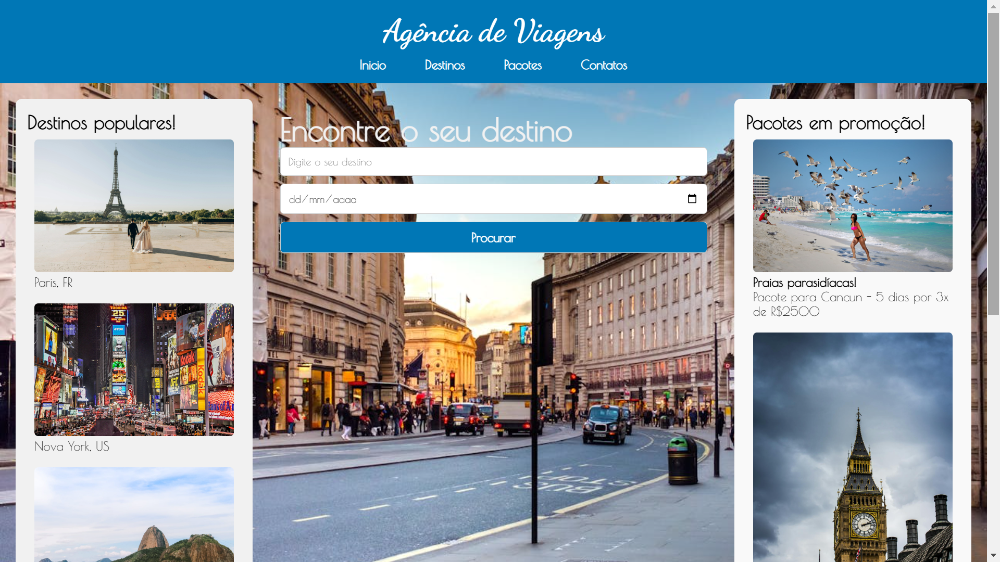

# Retomada de HTML e CSS: site de agência de viagem
 Criação de um modelo de alta fidelidade e um site usando html e css com responsividade, utilizado para a retomada do segundo ano após as férias
 
 Imagens do site completo (em desktop e celular, respectivamente)

  

<a href="https://www.figma.com/design/Hc9eqbD6Ypjdn7OTXiVT0j/Modelo-Alta-Fidelidade-de-Ag%C3%AAncia-de-Viagem?m=auto&t=cn6XjHTJQFKMtaC6-6" target="_blank" style="font-size: 20px">Modelos de alta fidelidade no Figma</a>
